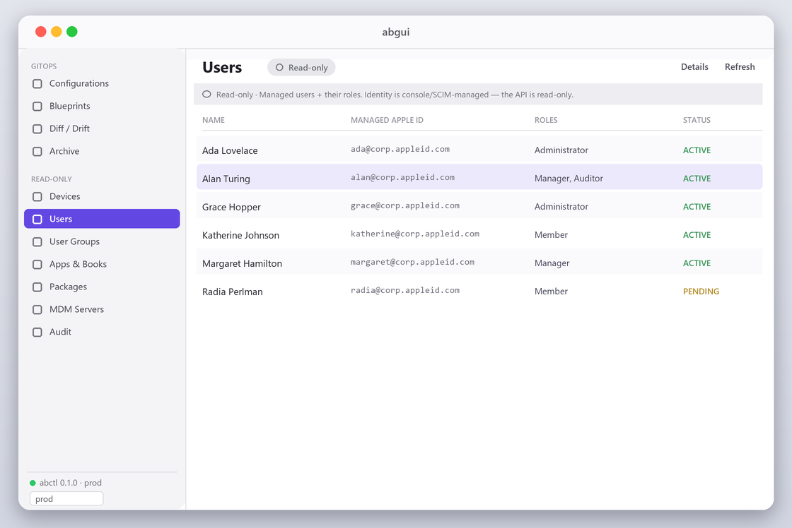

# abcli

**abcli** is Apple Business command-line and desktop tooling from Gigaion, LLC. It ships two tools:
**`abctl`**, the GitOps/imperative CLI, and **`abgui`**, a native macOS app that drives the same engine.

`abctl` keeps your organization's built-in-MDM **Configurations** (custom `.mobileconfig` profiles) and
full **Blueprint** membership — configurations, apps, packages, devices, users, and groups — in sync with a
git-declarative desired state — read-only by default, every write gated, with an archive-on-overwrite audit
trail. It also gives deep read-only inspection of the whole tenant (device detail + AppleCare, built-in-MDM
enrollment posture, users/roles, `status device <serial>`) and gated device→MDM-server assignment.
**[abgui](#abgui--native-macos-app)** is a native SwiftUI desktop app that bundles and shells out to `abctl`.

> **Status:** pre-1.0. Auth + read + plan are live-verified. Config CRUD and blueprint config-membership
> GitOps are built, unit-tested, and their core write operations verified live against a production Apple
> Business tenant. The Apple **API v2.0/v2.1** surface (detail reads, posture, blueprint lifecycle + all six
> membership collections, device assignment, MDM-server lifecycle) is built + unit-tested; its write verbs
> await first live runs. The **abgui** desktop app (dashboard · browse + inspectors · diff/drift · gated
> apply · archive rollback) is built and CI-green on macOS. See **[HANDOFF.md](HANDOFF.md)** for exact state
> and **[TODO.md](TODO.md)** for the roadmap.

---

## Tools

| Tool | What it is | Ships as |
|---|---|---|
| `abctl` | GitOps + imperative CLI for the Apple Business API | Cross-platform Go binary |
| `abgui` | Native macOS GUI on top of the embedded `abctl` engine | Signed/notarized macOS `.app` + DMG |

## Why abctl

Apple Business's built-in MDM has no batch/declarative API — only per-resource `POST`/`PATCH`/`DELETE`.
`abctl` **is** the reconcile engine: it diffs your git desired state against the live tenant and converges
them, so your MDM profiles and blueprint membership live in version control like any other infrastructure.

- **Read-only by default.** Every mutating operation is gated behind `--apply` + an interactive confirm.
- **Bidirectional, newest-wins.** Edit in git *or* the Apple Business console; `sync` reconciles both,
  with the more-recently-changed side winning a conflict.
- **Archive-on-overwrite.** Before overwriting or deleting any live config, `abctl` downloads and files the
  current version to `gitops/archive/` — a permanent, greppable record of everything ever replaced.
- **Exact drift detection.** Apple stores custom profiles byte-for-byte (verified live), so drift is a plain
  SHA-256 of the profile XML.
- **Safe blueprint GitOps.** Declare which profiles — and optionally which apps, packages, devices, users,
  and groups — each Blueprint carries; `abctl` attaches/detaches to match (detach gated behind `--prune`),
  creates git-only blueprints (members ride inside the create POST), leaves any collection you don't declare
  untouched, and never deletes a blueprint from GitOps.
- **Whole-tenant visibility.** `get device <serial>` (assigned MDM server + `--applecare` coverage),
  `get mdmdevices` (built-in-MDM enrollment posture: FileVault, firewall, last check-in, storage, lock),
  `get user|usergroup|app|package|mdmserver` detail, `get blueprint` with all six member collections
  resolved to names, `status device <serial>` (which blueprints/configs apply to this machine), and
  `-o csv` on every list.
- **Deployment plumbing, gated.** `assign|unassign --server` (bulk device→MDM assignment with `--wait`
  activity polling), blueprint + MDM-server lifecycle commands — same confirm gates as every other write.
- **Enterprise-grade engineering.** Cobra CLI, AGPL-3.0-or-later, race-tested unit + `httptest` suite,
  `golangci-lint` clean, gated live integration tests, and a Makefile — Linux/macOS CI.

## abgui — native macOS app



**[abgui](abgui/)** puts a native **Swift / SwiftUI** control plane on top of `abctl`. It ships as one
self-contained `.app` with a universal `abctl` **embedded inside it** (no separate install, no `PATH`),
reuses your `abctl` connection contexts, and re-implements none of the API — it shells out to the embedded
CLI, decodes its JSON, and renders it.

- **Connect from the GUI (no shell needed):** a **Settings** window (⌘,) to enter your Apple Business API
  **Client ID** + **EC private key** (paste the PEM or point at a `.pem`) and save it as an `abctl` context —
  so a Finder-launched app that inherits no `AB_*` environment still authenticates. The key is stored `0600`
  and handed to `abctl` as a file path (never on argv/logs); switch tenants from the same picker.
  Credentials live **outside** the app bundle — the context in `~/.abctl/contexts.yaml` and a pasted key
  under `~/Library/Application Support/abgui/keys/` — so **they survive app updates** (replacing `abgui.app`
  doesn't touch them). Only actively deleting those files, or an uninstaller that does, removes them.
- **Browse — read-only where the API is:** Configurations & Blueprints, plus clearly-badged **read-only**
  views of Devices, **Enrolled Devices** (built-in-MDM posture: FileVault, firewall, last check-in), Users
  (with roles), User Groups, Apps (catalog), Packages, MDM Servers, and the audit log — grouped in the
  sidebar as *GitOps* vs *Read-only*, under a **Dashboard** of click-through stat tiles. Every list has
  search, column sort, and CSV export; every entity opens a labeled **detail sheet** (device → assigned MDM
  server, opt-in AppleCare coverage, and which blueprints/configs apply; user → roles + HR fields; group →
  members; blueprint → all six member collections) with a raw-JSON fallback. (The separate VPP content-token
  *Apps & Books* screen is disabled — see the built-in-MDM note below.)
- **The GitOps hero:** a visual 3-way **diff / drift** view and a gated **`sync --apply`**. abgui defaults
  to Git source-of-truth with deletes/detaches enabled, uses smart Apple refresh by default, and exposes
  `--prune`, `--limit-writes`, refresh mode, and verification mode in the apply sheet.
- **Write, gated:** create / edit / delete configs, attach / detach blueprint membership, and multi-select
  device **Assign/Unassign to an MDM server** (with activity-status check) — each behind an in-app confirm
  (abctl is still invoked with its own `--yes` gate and archive-on-overwrite).
- **Archive / rollback:** browse every pre-overwrite live version abctl archived and restore one in a click.
- **Mac distribution:** local builds are ad-hoc signed; tagged GitHub releases can be Developer ID-signed
  and notarized when the Apple signing secrets are configured. Build it with `make gui-app` (macOS 14+).

See **[abgui/README.md](abgui/README.md)** and the design plan in **[docs/abgui-design.md](docs/abgui-design.md)**.

> The image above is a UI preview. abgui is macOS-only and builds on a macOS runner.

## Install & build

Requires **Go 1.26+** (the race-tested suite needs a C compiler / CGO).

```sh
make build          # → bin/abctl (version injected via ldflags)
make test           # go test -race ./...
make lint           # golangci-lint
./bin/abctl --help
```

No production credentials are needed to build or test — the unit suite mocks the API with `httptest`.

## Prerequisites (Apple Business)

1. **Enable built-in ("Included") MDM** for your organization in **Apple Business → Settings**. Without it,
   every `/configurations` and `/blueprints` request returns `403 INCLUDED_MDM_NOT_ENABLED` — this is an org
   capability toggle, not a key permission (verified live).
2. **Create an API account:** Apple Business → **Settings → Integrations → API** → create an account and
   **download the private key once** (it cannot be re-downloaded). SEC1 or PKCS#8 EC P-256 both work.
3. If the account was migrated from ABM/Essentials, grant it **Manage Blueprints** + **Create/edit device
   configurations** and regenerate the key (otherwise `403`).

> Users and user groups are **read-only** via the API (create/edit only in the console or via
> federation/SCIM). `abctl` never writes identity.

## Configure

Copy the template to a gitignored `.env` and fill it in:

```sh
cp .env.example .env
```
```ini
AB_CLIENT_ID=BUSINESSAPI.<uuid>
AB_PRIVATE_KEY=secrets/key.pem     # unencrypted EC P-256 — SEC1 or PKCS#8, abctl reads either
```
There is **no Key ID**: the client-assertion JWT deliberately omits `kid` (a `kid` → `400 invalid_client`),
and `aud` is the `/v2/token` form — both handled for you. Verify with:

```sh
abctl auth whoami
```

## Quick start (the GitOps loop)

```sh
abctl seed                 # 1. download the live tenant → gitops/ tree + committed baseline
git add gitops/            #    review, then commit the tree as your source of truth
                           # 2. edit gitops/lib/**/*.mobileconfig and gitops/blueprints/*.yml in git
abctl diff                 # 3. see the 3-way plan (configs + blueprint membership); no writes
abctl sync                 # 4. same plan (dry-run is the default) — nothing is written
abctl sync --apply         # 5. execute it: archive-before-overwrite, confirm before any write
```

`sync --apply` runs in two phases — **configs first** (create/update/pull/delete), **then blueprint
membership** (so a profile created in step 5 can be attached in the same run). It asks you to type `yes`
before touching the tenant unless `--yes` (or `$ABCTL_APPROVE=1` for CI) is set.

For a one-way GitOps converge where the repo is authoritative, use:

```sh
abctl diff --git-source-of-truth
abctl sync --apply --git-source-of-truth --prune
```

`--git-source-of-truth` means live-only Apple configs are deleted instead of pulled into git; on apply it
implies prune in the engine, and spelling `--prune` keeps the intent obvious. The default live-read behavior
is `--refresh=smart`: abctl performs a cheap Apple metadata list, reuses cached profile hashes when the Apple
ID and `updatedDateTime` match the committed baseline, and fetches profile XML only when comparison,
pulling, pruning, or archive-before-overwrite safety requires it.

### On-disk layout (`gitops/`)

```
gitops/
├── lib/…/<name>.mobileconfig         # CUSTOM_SETTING profiles — the desired state, one file per config
├── blueprints/<slug>.yml             # per-blueprint: name, id, and its list of attached config names
├── state/sync-state.json             # COMMITTED baseline: name → {id, hash, updatedDateTime}
└── archive/<name>/<UTC-ts>--<reason>.mobileconfig (+ .json sidecar)   # pre-overwrite live versions
```
The tree is **gitignored by default** (seeded profiles can carry secrets); un-ignore it deliberately once
you adopt it as your committed source of truth.

A blueprint manifest is just its desired config membership:
```yaml
name: Sales Team
id: 1c6f7213-236f-4f5b-837c-71acb16a0b9b
description: field sales macs
configurations:
  - wifi-corp.mobileconfig
  - vpn-always-on.mobileconfig
```
`abctl` **attaches** configs listed in git but not in ABM, and (only with `--prune`) **detaches** configs
attached in ABM but removed from git. Blueprint create/delete and device/user/group membership are managed
in the console; `abctl` reports but doesn't act on them.

## Command reference

`abctl` has two modes — a **GitOps** engine and **imperative** commands — in one binary.
Global flags: `-o/--output table|json|yaml`, `--context <name>` (see `abctl context`). Every write is gated
(confirm unless `--yes`/`$ABCTL_APPROVE`); imperative writes also update the local `gitops/` tree + baseline
inline (`--no-write-tree` to skip). Full design: **[docs/imperative-cli.md](docs/imperative-cli.md)**.

```
# read
abctl auth whoami                                   # verify auth + reachability
abctl get configurations|blueprints|devices|audit   # + users|usergroups|apps|mdmservers  (--filter key=substr)
abctl get configuration <name|id> [--profile]       # show one (--profile dumps raw .mobileconfig XML)

# GitOps (declarative, whole-tree)
abctl seed                                          # live tenant → gitops/ tree + baseline
abctl validate                                      # validate lib/ profiles
abctl diff | sync [--exit-on-diff] [--refresh smart|full|metadata-only]
abctl sync --apply [--git-source-of-truth] [--prune] [--yes] [--limit-writes N] [--verify targeted|full|none]

# imperative (one resource at a time)
abctl create  config <name> -f profile.mobileconfig # POST a new CUSTOM_SETTING config
abctl replace config <name|id> -f profile.mobileconfig   # archive live, then PATCH
abctl edit    config <name|id>                      # fetch → $EDITOR → PATCH on save
abctl delete  config <name|id> [--yes]              # archive live, then DELETE
abctl apply -f a.yml [-f b.yml] [--dry-run]         # upsert abctl/v1 Configuration|Blueprint specs (bulk)
abctl attach|detach config <name> --blueprint <bp>  # add/remove a config from a blueprint
abctl attach|detach app <name|id> --blueprint <bp>  # built-in-MDM Apps & Books: assign an owned app to a blueprint
abctl pull [config <name>]                          # adopt a console edit into git (scoped seed)

# status (honest proxies — NOT on-device install verification)
abctl status config <name>                          # which blueprints carry it + devices targeted
abctl status audit [--since 24h --type … --actor …] # config/device change history

# contexts + escape hatch
abctl context set|use|get|list|current              # named-connection tenants (~/.abctl/contexts.yaml)
abctl api <path> [-X POST -F k=v --input body.json] # raw request (non-GET is gated)
abctl version | completion | help
```

**Flags that matter:** `--apply` (execute; default is dry-run) · `--prune` (allow deletes/detaches; **off by
default**) · `--yes` / `$ABCTL_APPROVE=1` (skip the confirm, for CI) · `--limit-writes N` (circuit breaker on
tenant writes, shared across configs + blueprints) · `--exit-on-diff` (exit `3` when changes are pending —
for PR gating).

Current sync controls also include `--git-source-of-truth` (treat `gitops/` as authoritative),
`--refresh smart|full|metadata-only` (`smart` is the default cheap-list/cache mode), and
`--verify targeted|full|none` after apply (`targeted` is the default).

**Exit codes:** `0` ok · `1` error · `2` usage · `3` changes pending (with `--exit-on-diff`).
Data → stdout, diagnostics → stderr; `--json` for machine output.

## Safety model

- **Read-only by default** — `diff` and `sync` (no `--apply`) never write.
- **Every write gated** behind `--apply` + confirmation; **`--prune` off by default** (nothing is deleted or
  detached unless you ask).
- **Archive-before-overwrite** — a failed archive *skips* the write it protects, so the audit trail is never
  bypassed.
- **Newest-wins conflicts** compare the live `updatedDateTime` against the git file's commit time (else its
  mtime); an ambiguous case is skipped, never guessed.
- **Never commit secrets** — `.env`, `secrets/`, keys, tokens, and the generated `gitops/` tree are all
  gitignored. See **[SECURITY.md](SECURITY.md)**.

## CI/CD

Works on **both GitHub and GitLab** — [`.github/workflows/`](.github/workflows/) and
[`.gitlab-ci.yml`](.gitlab-ci.yml) drive the identical flow (`abctl` is CI-agnostic: reads `AB_*` from
the environment, signals via exit codes). Full setup — including the GitLab job map — in
**[docs/cicd.md](docs/cicd.md)**.

**CI** runs build/vet/race-test on Linux + macOS, `golangci-lint`, and **gated live integration tests**
(read-only + a strictly-gated write round-trip) that self-skip without secrets.

**CD** is three GitOps pipelines (also self-skipping); the GitHub workflows:

| Workflow | Trigger | Does |
|---|---|---|
| **Plan** (`cd-plan.yml`) | PR touching `gitops/**` | `sync --dry-run` → posts the plan as a PR comment (no writes) |
| **Apply** (`cd-apply.yml`) | merge to `main` (or manual) | gated `sync --apply` behind a protected `production` environment → reconciles + commits the baseline back |
| **Drift** (`cd-drift.yml`) | daily cron | `sync --dry-run --exit-on-diff` → alerts if the console drifted from git |

On GitLab the same three run as the `plan` / `apply` / `drift` jobs in `.gitlab-ci.yml` (MR / manual on a
protected `production` environment / pipeline schedule). In CI either way, `abctl` reads config from the
environment (`AB_CLIENT_ID` + `AB_PRIVATE_KEY`) — no `.env` needed.

**Run it locally too.** [`scripts/pipeline.sh`](scripts/pipeline.sh) drives the identical stages on your
own machine — no CI required — so you can plan/apply/drift against the current branch by hand:

```sh
./scripts/pipeline.sh ci      # build + gofmt + vet + test (+ lint) — no secrets
./scripts/pipeline.sh plan    # READ-ONLY: what `apply` would change
./scripts/pipeline.sh drift   # READ-ONLY: exit 3 if git and the tenant diverge
./scripts/pipeline.sh apply   # LIVE, gated writes (--commit to mirror CI's baseline commit-back)
```

It's the same logic the workflows run, so local and CI never disagree.

## Verified API facts (from live testing — trust these)

- Auth omits `kid`; `aud = …/oauth2/v2/token`; bearer TTL 60 min.
- Only `CUSTOM_SETTING` configs are API-writable; their profile XML is **raw** (not base64) and `GET`
  round-trips it **byte-identically** → drift = raw SHA-256. `POST 201` / `PATCH 200` / `DELETE 204`.
- The API validates uploads: a malformed profile (e.g. empty `PayloadContent`) → `400 PARAMETER_ERROR`.
- A Blueprint **create requires both a member** (device/user/group) **and content** (app/package/config).
- Blueprint membership `POST` is **additive (merges)**; `DELETE`-with-body removes a specific member — so
  `abctl` converges membership per-member.
- Users/userGroups are **read-only** via the API; built-in MDM must be **enabled** in the console.
- The API rate-limits hard — `abctl` backs off (Retry-After aware); avoid rapid loops.

## Docs

- **[docs/design-abctl.md](docs/design-abctl.md)** — architecture: bidirectional sync, newest-wins, archive-on-overwrite, blueprint membership.
- **[docs/cicd.md](docs/cicd.md)** — the GitOps CI/CD pipelines (plan / apply / drift) and how to set them up.
- **[docs/imperative-cli.md](docs/imperative-cli.md)** — design + roadmap for the imperative CLI + signed binary release.
- **[docs/abgui-design.md](docs/abgui-design.md)** — the abgui (native macOS GUI) design plan.
- **[docs/vpp-design.md](docs/vpp-design.md)** — Apps & Books (VPP) — verified App-and-Book-Management-API-v2 reference + plan.
- **[abgui/README.md](abgui/README.md)** — the desktop app: scope, layout, and how to build / run it.
- **[docs/auth.md](docs/auth.md)** + **[docs/endpoints/](docs/endpoints/)** — the *live-verified* Apple Business API reference.
- **[HANDOFF.md](HANDOFF.md)** / **[TODO.md](TODO.md)** — current state and roadmap.
- **[AGENT.md](AGENT.md)** — instructions for AI agents working in this repo.
- **[CONTRIBUTING.md](CONTRIBUTING.md)** · **[SECURITY.md](SECURITY.md)**

## Built by AI

`abcli`, including `abctl` and `abgui`, is AI-authored under Gigaion, LLC's direction.
Review it with the same judgment you would apply to any production infrastructure tool.

## License

[AGPL-3.0-or-later](LICENSE) — Copyright © 2026 **Gigaion, LLC**.
