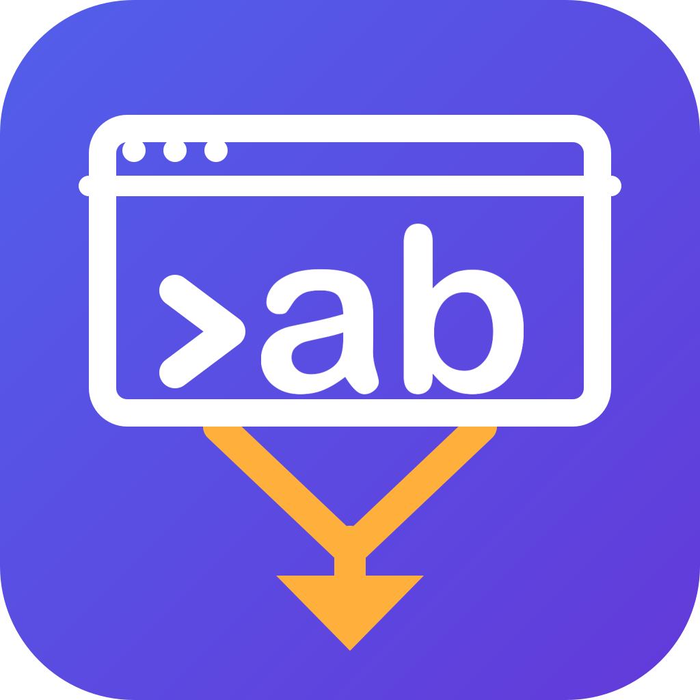

<!-- Copyright 2026 Gigaion, LLC -->
<!-- SPDX-License-Identifier: AGPL-3.0-or-later -->

# Brand assets



The `abcli` suite mark, used by **abctl** and **abgui** alike.

A terminal window running `> ab`, with two branches leaving the window and merging into one
arrow. It says what the product is — a CLI, and a GUI that drives one — and what it does:
reconciles two states into one. `ab` is Apple Business, and it is also the two things being
merged, declared and live. The letterforms and the indigo-violet ground are carried over from
the original abgui mark — measured off it, not approximated — because that is what people
already recognise the product by.

## Regenerating

```sh
python docs/brand/render-icon.py          # -> abcli-icon.svg + abcli-icon-1024.png
cd abgui-flutter && dart run flutter_launcher_icons
```

**Both files are generated.** Edit the constants at the top of `render-icon.py`, never the SVG
or the PNG — they are emitted from one set of numbers precisely so they cannot drift, and
raster drift is invisible because nobody diffs a PNG.

`flutter_launcher_icons` then produces the macOS `.icns` set and the Windows `.ico` from the
PNG. Linux and the Microsoft Store package take `abgui-flutter/assets/icon/abgui.png`, which is
a copy of the master — refresh it with the master, do not edit it in place.

## Where each platform gets its icon

| Platform | Source | Produced by |
|---|---|---|
| macOS `.app` | `macos/Runner/Assets.xcassets/AppIcon.appiconset/` (7 sizes) | `flutter_launcher_icons` |
| Windows `.exe` | `windows/runner/resources/app_icon.ico` | `flutter_launcher_icons` |
| Linux AppImage | `abgui-flutter/assets/icon/abgui.png` | copied into the AppDir by `build-gui-flutter.sh` |
| Microsoft Store | `abgui-flutter/assets/icon/abgui.png` | `msix_config.logo_path` |
| README / docs | `docs/brand/abcli-icon.svg` | this generator |

macOS and Windows shipped the **stock Flutter logo** through v0.4.30 — those two need generated
multi-size containers, and nobody had produced them, while the AppImage and the Store tiles took
a plain PNG and so looked correct. If an icon ever looks wrong on one platform only, that
asymmetry is the first thing to check.

## Design constraints worth keeping

- **16 px decides it.** The Finder list and the menu bar are where an icon is judged; anything
  that only works at 512 is not an app icon.
- **No `<text>` element.** The letters are drawn as strokes and arcs, so there is no font
  dependency and the mark cannot silently rasterise in a fallback typeface.
- **Keep the merge V open.** Branch origins too close together fuse into a solid wedge below
  ~32 px and stop reading as a merge. The long diagonal run is load-bearing, not styling.
- **The letterforms are measured, not drawn by eye.** From the original mark: x-height 270,
  stroke 66 (0.24 of the x-height — much bolder than a normal geometric sans, and the reason it
  reads as friendly rather than technical), b-ascender 1.37x, letter gap 0.20x. Keep those ratios
  if the size changes.

Rejected directions, recorded so they are not retried: a bare `ab` wordmark filling the tile
(the two letters read as "alo" with nothing around them to anchor the reading — inside the
terminal, with a `>` in front, they read as a command and the ambiguity disappears); an apple
silhouette (a leaf plus a top notch reads as an animal head, and fruit on a product that manages
Apple Business Manager is the highest-risk place to put it); and letters standing beside an
arrow, which reads as clip-art because the branches have to LEAVE something.
